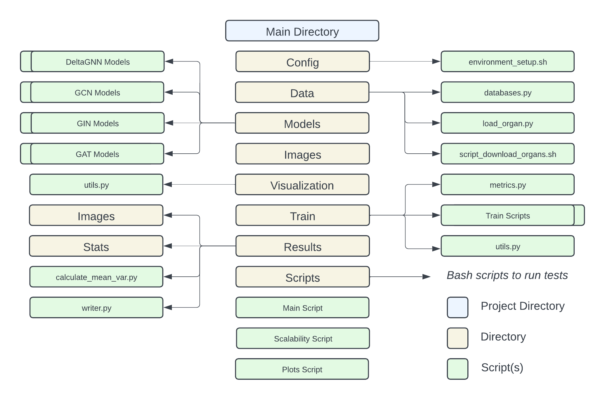

# DeltaGNN: Graph Neural Network with Information Flow Control
This repository is part of a journal paper under-submission to IEEE TPAMI. It contains the main source code for our proposed topological-aware architecture with interaction-decoupling module and Information Flow Control mechanism, and a GNN benchmark implementing well-known baselines such as GCN, GIN, and GAT. Additionally, the [data](./data/) directory has a data generator script to convert the medical image datasets MedMNIST Organ-C and Organ-S into graphs. Follows an overview of the structure of the repository:




<br>


## 1. Benchmark installation

Follow these instructions to install the benchmark and set up the environment.

### 1.1 Setup Conda

To manage Python environments and packages effectively, first install Conda. This tool helps in creating isolated environments and managing dependencies.

#### For Linux
```bash
# Download and install Miniconda (a minimal Conda installer) for Linux
curl -o ~/miniconda.sh -O https://repo.continuum.io/miniconda/Miniconda3-latest-Linux-x86_64.sh
chmod +x ~/miniconda.sh    
./miniconda.sh  
source ~/.bashrc
```

#### For macOS
```bash
# Download and install Miniconda for macOS
curl -o ~/miniconda.sh -O https://repo.continuum.io/miniconda/Miniconda3-latest-MacOSX-x86_64.sh
chmod +x ~/miniconda.sh    
./miniconda.sh  
source ~/.bash_profile
```

### 1.2 Setup Python environment

Next, to utilize GPU acceleration, CUDA is required. Here, we show how to install CUDA 11.8 and set up the Python environment for GPU-based computations. Ensure that the CUDA version is compatible with your hardware and other installed libraries. Here, we assume to be using the operative system Ubuntu 22.04.

For Ubuntu **22.04** - Only if CUDA 11.8 is not already installed

```bash
# Remove old CUDA and NVIDIA packages to avoid conflicts
sudo apt-get --purge remove "*cublas*" "cuda*" "nvidia*"
sudo apt autoremove

# Download and install CUDA 11.8 for Ubuntu 22.04
wget https://developer.download.nvidia.com/compute/cuda/11.8.0/local_installers/cuda-repo-ubuntu2204-11-8-local_11.8.0-520.61.05-1_amd64.deb
sudo dpkg -i cuda-repo-ubuntu2204-11-8-local_11.8.0-520.61.05-1_amd64.deb
sudo cp /var/cuda-repo-ubuntu2204-11-8-local/cuda-*-keyring.gpg /usr/share/keyrings/
sudo apt-get update
sudo apt-get install -y cuda-11-8

# Reboot to apply CUDA changes
sudo reboot

# Verify CUDA installation
cat /usr/local/cuda/version.txt  # Check CUDA version is 11.8
```

Once the environment is ready, we can proceed with creating a Conda environment and installing all the required dependencies. In order to do this you just need to clone the repository and execute the script [environment_setup.sh](./config/environment_setup.sh) containing all the required commands to create and activate a python environment called [benchmark_gnn_slim](./config/environment_slim.yml) and install all the required dependencies.

```bash
# Clone the GitHub repository containing the benchmark code
conda install git
git clone REPO_LINK
cd DeltaGNN

# Create and install the Python environment for GPU
chmod +x config/environment_setup.sh
./config/environment_setup.sh
```

**Note:** The versions of CUDA and PyTorch packages should be compatible with each other. Adjust versions if necessary based on compatibility with your system.


<br>

## 2. Preparation Datasets

Download the datasets needed for benchmarking and training. The datasets are automatically handled by `pytorch-geometric` for Planetoid datasets, while the medical datasets require a script to convert image data into graph formats.

Proceed as follows to download the benchmark datasets.


### 2.1 Organ-S & Organ-C datasets

While for most of the datasets no additional preparation is required since they are natively graph-based (the torch-geometric module will automatically download them), we need to do some pre-processing to use MedMNIST Organ-S and Organ-C since they contain medical images. In order to do this, we included a script [script_download_organs.sh](./data/script_download_organs.sh) which vectorizes the pixel intensiies and generate a graph based on the cosine similarity between the samples. The generated graphs have two types of density, providing different perspectives on the data.

```bash
# Navigate to the data directory and execute the script to download and convert datasets
cd data/
bash script_download_organs.sh
```


### 2.2 Other datasets

These datasets are managed automatically by `pytorch-geometric`. Ensure the dependencies are correctly installed for automatic dataset handling.

<br>

## 3. Reproducibility 

In this section, we detail how to reproduce the experiments conducted in this work. We first explain how is it possible to run experiments and then to generate plots and statistics on the results.

### 3.1 Run in Terminal Using Main Script

There are two ways to run our models. First, it is possible to execute the main file and directly run a specific model setting. Follow a few examples:

```bash
# Example commands to run the main file at the root of the project

python main_multilabel_classification.py --dataset_name Cora --batch_norm --do_eval --print_result --model_type GCN --num_epoch 300 --hidden_channels 2048

python main_multilabel_classification.py --dataset_name Organ-C --batch_norm --do_eval --print_result --model_type GAT --num_epoch 300 --hidden_channels 256 --remove_edges 5000 --topological_measure random

python main_multilabel_classification.py --dataset_name Organ-S --batch_norm --do_eval --print_result  --model_type DeltaGNN --num_epoch 300 --remove_edges 5000 --max_communities 500 --hidden_channels 1024 --topological_measure curvature
```


### 3.2 Run in Terminal Using Script

For quicker tests, you can use the provided script file. Alternatively, modify this script or create new ones as needed.

```bash
# Navigate to the main directory and execute a test script
bash scripts/run_planetoid_test.sh
```

Review [`run_planetoid_test.sh`](../scripts/run_planetoid_test.sh) to understand the script’s setup and adjust it according to your needs.

### 3.3 Output Results

Model performance results are saved in `results/stats` with filenames like `result_DATASET.csv`. To compute statistics from multiple runs, use the provided script.

```bash
# Calculate mean and variance over multiple runs
cd results
python calculate_mean_var.py stats/LOG_FILENAME.csv
```

Additionally, while running experiments, heterophily and homophily distribution shifts will be saved in `results/images`.


<br><br><br>

